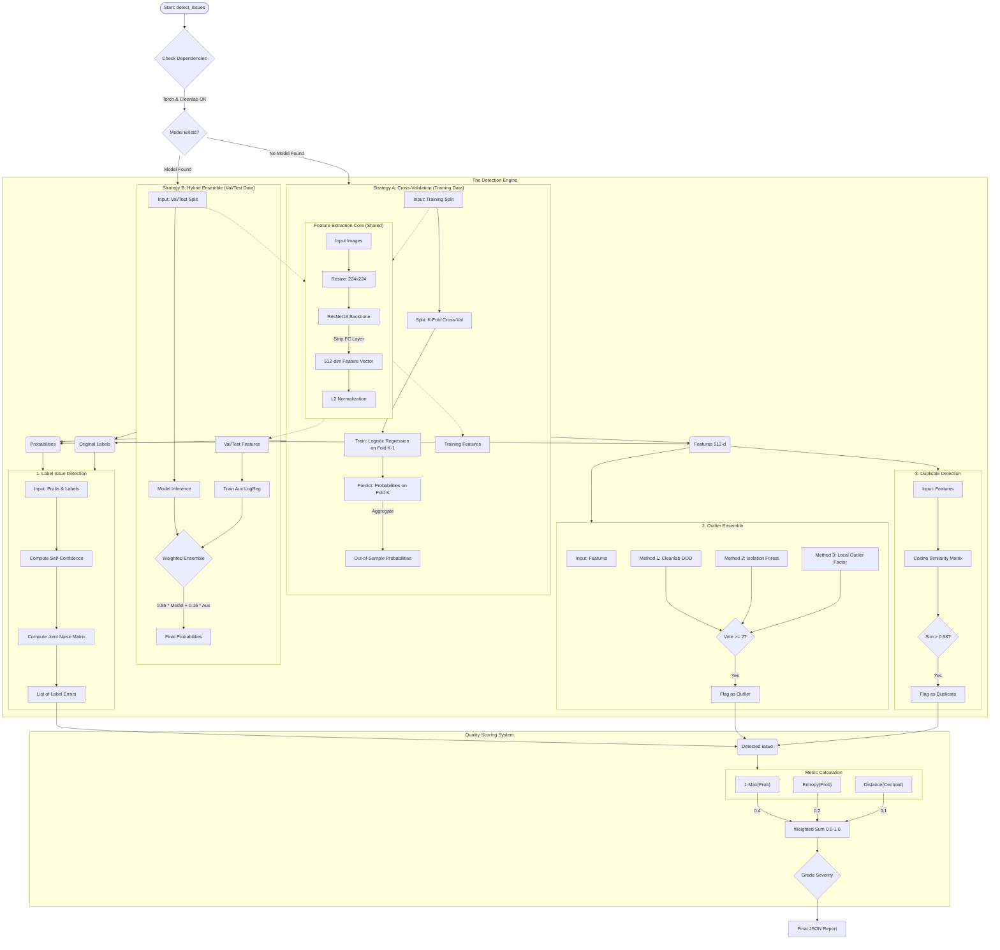

# Data Issue Detection & Filtering Architecture

This document provides a comprehensive deep-dive into the "Data Filter" logic implemented in `backend/app/services/data.py`. It explains the hybrid architecture, the mathematical algorithms used, and the decision-making strategies for cleaning machine learning datasets.

---

## 1. High-Level Architecture

The system is designed to identify three types of data issues:
1.  **Label Issues**: Images that are mislabeled (e.g., a "Good" chip labeled as "Defect").
2.  **Outliers**: Images that do not look like anything else in the dataset (e.g., corrupted files, OOD data).
3.  **Duplicates**: Identical or near-identical images that bias validation results.

### System Diagram

---

## 2. Detection Strategies

The system uses two different strategies depending on *which* dataset is being analyzed. This is critical to avoid bias.

### Strategy A: Cross-Validation (For Training Data)
**Problem:** If you ask a model to find errors in the data it was trained on, it will fail. The model has "memorized" the training images, even the mislabeled ones. It will likely say "Confidence 99% this is a Cat" even if it's a dog, because you told it so during training.

**Solution (CV):**
1.  We split the training data into $K$ parts (folds).
2.  We train a temporary, lightweight model (Logistic Regression) on Parts 1 & 2.
3.  We use that model to predict probabilities for Part 3.
4.  **Result:** The predictions for Part 3 are "Out-of-Sample." The model never saw these images during training, so its predictions are unbiased. If the model says "This looks like a Dog" but the label is "Cat," we likely have a real label error.

### Strategy B: Hybrid Ensemble (For Validation/Test Data)
**Problem:** Validation data is unseen. We want to use our *best* and most powerful model (ResNet18) to judge it, not a weak temporary one.

**Solution (Hybrid):**
1.  **Expert Model:** We load the fully trained `best_model.pth`.
2.  **Auxiliary Model:** We also train a lightweight Logistic Regression on the validation features.
3.  **Ensemble:** We combine predictions: `Final_Prob = 0.85 * Best_Model + 0.15 * Aux_Model`.
4.  **Why?** Deep Learning models can sometimes be "overconfident" on wrong answers. The simpler auxiliary model acts as a "sanity check" (regularizer) to smooth out the probability distributions, making the error detection more reliable.

---

## 3. Algorithm Deep-Dive

### A. Feature Extraction (ResNet18)
Before any analysis, images are converted into math.
*   **Backbone:** ResNet18 (Pre-trained on ImageNet).
*   **Process:** We cut off the final "Head" (the part that says "Cat" or "Dog").
*   **Output:** We take the output of the penultimate layer.
*   **Result:** Every image becomes a vector of **512 numbers**. This vector represents the "DNA" of the image—its shapes, textures, and patterns.

### B. Cleanlab (Confident Learning)
Used for: **Label Issues**
*   **Core Idea:** Instead of just looking for wrong predictions, Cleanlab estimates the "Joint Distribution of Label Noise."
*   **Mechanism:**
    1.  It calculates a matrix $C$ where $C_{ij}$ is the probability that an image labeled as Class $i$ actually belongs to Class $j$.
    2.  It uses "pruning" to remove images that fall into the "off-diagonal" of this matrix with high confidence.
    3.  This method is robust against **Class Imbalance**. If you have 1000 cats and 10 dogs, a simple threshold would ignore the dogs. Cleanlab normalizes by class frequency.

### C. Isolation Forest
Used for: **Outlier Detection**
*   **Intuition:** "Anomalies are few and different."
*   **Mechanism:**
    1.  It randomly cuts the data points with lines (decision trees).
    2.  If a point is "normal" (inside a cluster of other points), you need many cuts to isolate it.
    3.  If a point is an "outlier" (floating alone in space), it gets isolated very quickly (few cuts).
    4.  **metric:** Short path length in the tree = High Anomaly Score.

### D. Local Outlier Factor (LOF)
Used for: **Outlier Detection**
*   **Intuition:** "Density-based Isoloation."
*   **Mechanism:**
    1.  It compares the local density of point A (how close its neighbors are) to the local density of its neighbors.
    2.  If point A is in a sparse region, but its neighbors are in dense regions, point A is an outlier.
    3.  This is better than Isolation Forest for finding outliers that are near a cluster but not *part* of it.

### E. Cosine Similarity
Used for: **Duplicates** & **Quality Scoring**
*   **Formula:** $\text{Similarity} = \frac{A \cdot B}{||A|| \times ||B||}$
*   **Application:**
    *   **Duplicates:** If Similarity > 0.98, the images are effectively identical.
    *   **Centroids:** We calculate the "Center" (Average Vector) of the "Good" class. If a "Good" image has a low cosine similarity to this center, it is a low-quality or atypical example.

---

## 4. Quality Scoring System

Every detected issue is assigned a **Quality Score (0.0 - 1.0)** to help you prioritize what to fix. Higher score = Worse quality (more urgent).

The score is a weighted sum of four metrics:

1.  **Confidence Score (Weight: 0.4)**
    *   How confident is the model that the label is wrong?
    *   `1.0 - Max_Prob`
2.  **Mismatch Score (Weight: 0.3)**
    *   Does the prediction match the label?
    *   `1.0` if mismatch, `0.0` if match.
3.  **Entropy Score (Weight: 0.2)**
    *   Is the model confused? (e.g., 50% Cat, 50% Dog).
    *   High Entropy = High Uncertainty.
4.  **Isolation Score (Weight: 0.1)**
    *   How far is this image from the center of its class in feature space?
    *   Measured using Euclidean distance to Class Centroid.

**Severity Grading:**
*   **CRITICAL (> 0.9)**: Model is extremely confident this is wrong. Fix immediately.
*   **HIGH (> 0.7)**: Strong evidence of error.
*   **MEDIUM (> 0.5)**: Likely an error, or a very hard/ambiguous example.
*   **LOW (< 0.5)**: Potential duplicate or edge case.

---

## 5. Code Reference
All logic is contained in `backend/app/services/data.py`.

*   `detect_issues()`: Main entry point. Decides Strategy A or B.
*   `detect_issues_in_split()`: Implements **Strategy A (CV)**.
*   `detect_issues_with_model()`: Implements **Strategy B (Hybrid)**.
*   `extract_features()`: Runs ResNet18.
*   `detect_outliers_ensemble()`: Runs IsolationForest + LOF + Cleanlab OOD.
*   `calculate_quality_score()`: Implements the scoring math.
