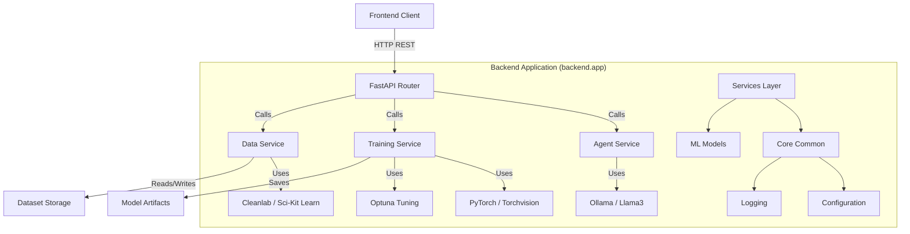
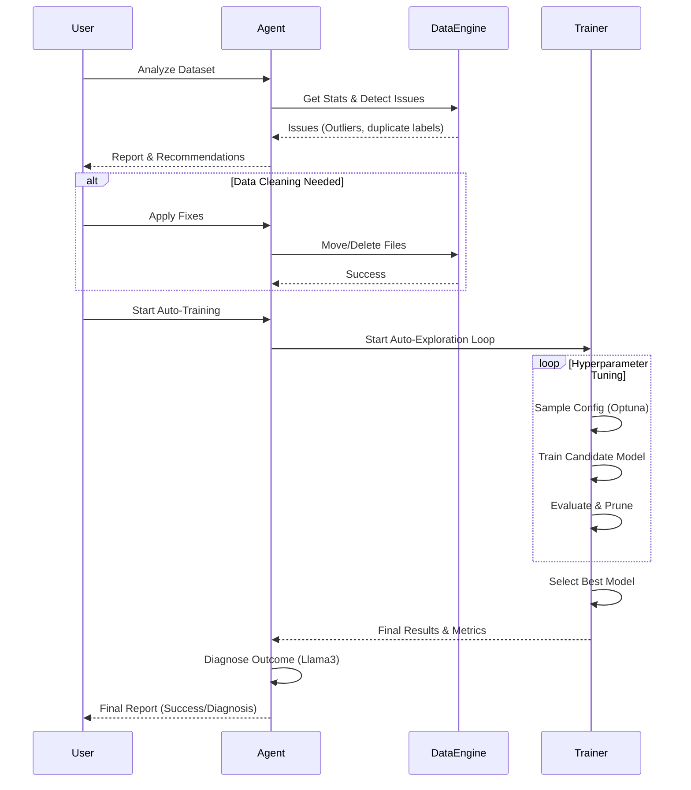

# Agent AI 2035: Autonomous AutoML Agent

A professional, autonomous machine learning agent capable of analyzing datasets, diagnosing issues, cleaning data, and performing automated hyperparameter tuning and training.

## 🌟 Features
- **Autonomous Analysis**: Uses Llama3 and Cleanlab to detect dataset issues (outliers, label errors).
- **Auto-Cleaning**: Suggests and applies fixes for data quality issues.
- **AutoML Exploration**: Uses Optuna to autonomously find the best hyperparameters.
- **Agentic Diagnosis**: Post-training analysis by an AI agent to explain performance gaps and suggest next steps.
- **Robust Architecture**: Modular backend design separating API, Services, and Core logic.

## 🏗️ System Architecture

The system follows a modular Layered Architecture pattern.



## 🔄 Application Workflow

The following flowchart illustrates the autonomous loop of the agent.



## 📁 Project Structure

```
agent-ai-2035/
├── backend/
│   └── app/
│       ├── api/         # Routes and Endpoints
│       ├── core/        # Config and Logging
│       ├── services/    # Business Logic (Agent, Data, Training)
│       ├── ml/          # Neural Network Definitions
│       ├── schemas/     # Pydantic Models
│       └── main.py      # Entry Point
├── frontend/            # HTML/JS Client
├── dataset/             # Data Storage
└── tests/               # Validation Scripts
```

## 🚀 Getting Started

### Prerequisites
- Python 3.9+
- Node.js (optional, for advanced frontend dev)
- Ollama (running Llama3)

### Installation

1. **Clone the repository**
   ```bash
   git clone <repo-url>
   cd agent-ai-2035
   ```

2. **Create Virtual Environment**
   ```bash
   python -m venv venv
   .\venv\Scripts\activate
   ```

3. **Install Dependencies**
   ```bash
   pip install -r requirements.txt
   ```

### Running the Application

1. **Start the Server**
   ```bash
   uvicorn backend.app.main:app --reload
   ```

2. **Access the Interface**
   Open `http://localhost:8000` in your browser.

## 🧪 Testing

Run the verification suite to ensure system health:
```bash
python tests/verify_all.py
```
