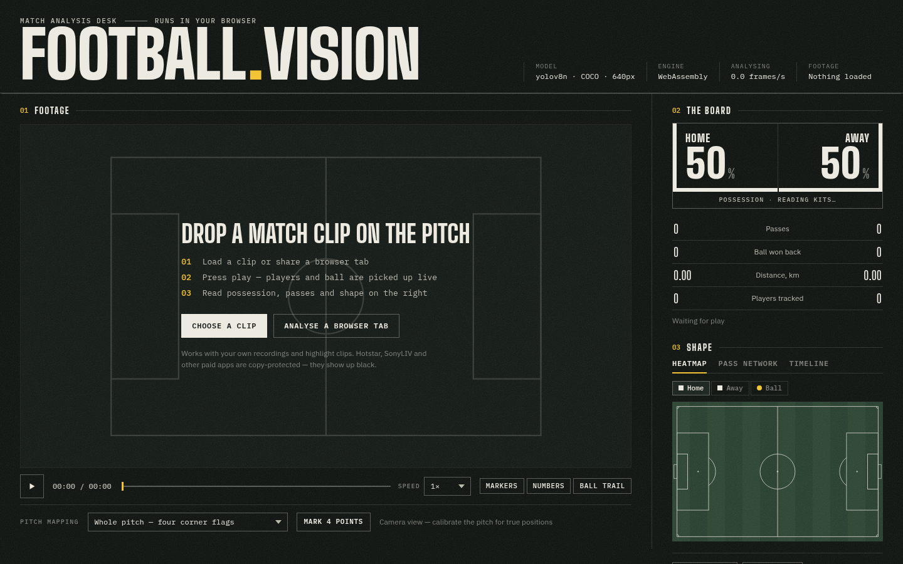

# Football Vision

Drop in a football clip and watch the players, the ball, possession and passes
get picked out while it plays. Everything runs in the browser. The footage
never leaves your machine, and there is no server to pay for.



## What it does

- **Finds players and the ball** in every analysed frame with a YOLOv8n model
  running through ONNX Runtime Web (WebGPU when available, WebAssembly otherwise).
- **Follows each player** with a stable number across frames, and resets
  cleanly when the broadcast cuts to another camera.
- **Works out the two teams** from shirt colours. No setup needed. Referees
  usually land in their own group.
- **Tracks possession**: who is on the ball, for how long, and whether the
  next touch was a pass to a team-mate or the ball being won back.
- **Draws the shape of the game**: chalk heatmaps per team and for the ball,
  a pass network, and a clickable timeline of events.
- **Maps to real pitch metres** after you click four known points, such as the
  corners of a penalty area. Before that, distance is estimated from player
  height.
- **Exports** the numbers as JSON and the events as CSV.

## Where the footage comes from

| Source | Works? |
|---|---|
| A video file (your own recording, a downloaded highlight) | Yes |
| A browser tab playing YouTube or FanCode highlights ("Analyse a browser tab") | Yes |
| Hotstar / JioHotstar, SonyLIV, Netflix, Prime | No. They are DRM-protected, so the browser only hands over black frames. The app spots this and says so. |

## Quick start

You need Node 20+ for the web app. Python 3.10+ is only needed to retrain or
re-export the model.

```bash
cd web
npm install
npm run dev          # http://localhost:5173
```

The repo ships a ready-made model in `web/public/models/`, so that's all you
need. Load a clip, press play, and read the board on the right.

Other commands:

```bash
npm test             # unit tests (Vitest)
npm run build        # static site in web/dist — deploy anywhere
```

### Python side (optional)

```bash
cd ml
python -m venv .venv && source .venv/bin/activate
pip install -r requirements.txt

python export_onnx.py                     # stock COCO YOLOv8n -> web/public/models
python train.py --data data/football.yaml # fine-tune on football data, then export
python analyze.py match.mp4               # offline tracking for long videos
pytest                                    # checks the exported model
```

## Repository layout

```
web/            Vite + TypeScript app (no framework)
  src/          detector, tracker, teams, ball, events, pitch, stats, render/
  tests/        Vitest suites for all the pure logic
  public/models model.onnx + meta.json that the app loads
ml/             Python: export, fine-tune, evaluate, offline analysis
  tools/        make_test_clip.py, a synthetic clip with known ground truth
docs/           the longer write-ups (linked below)
```

## Documentation

- [Architecture](docs/architecture.md): the per-frame pipeline and how the
  pieces fit together.
- [Model](docs/model.md): the stock model, fine-tuning on football data,
  and the `meta.json` contract.
- [Web app](docs/web-app.md): using the interface, calibration, exports,
  and deployment.
- [Limitations](docs/limitations.md): what it gets wrong and why, so you
  know how far to trust the numbers.

## Why Python and the browser both

Python is where training and evaluation belong: ultralytics, datasets, GPUs.
The browser is where the analysis runs. Once a model is exported to ONNX, the
browser runs it with no server, no upload wait, and live analysis of a shared
tab. Python improves the model; the web app uses it.

## Honest numbers

The stock COCO model is good at people and weak at a small, fast football.
The app compensates in two ways. It fills short gaps in the ball's path, and
when the full frame misses the ball it re-checks a zoomed crop around where
the ball was last seen. A model fine-tuned on football footage (`ml/train.py`)
is still the biggest upgrade. Treat possession and pass counts as estimates,
not official data. [Limitations](docs/limitations.md) has the details.

## Licence note

YOLOv8 and its weights come from Ultralytics under AGPL-3.0. If you host
this publicly, keep the source available (a public repo covers that), or use
a model with a licence that suits you.
